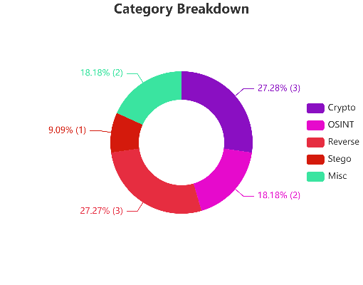
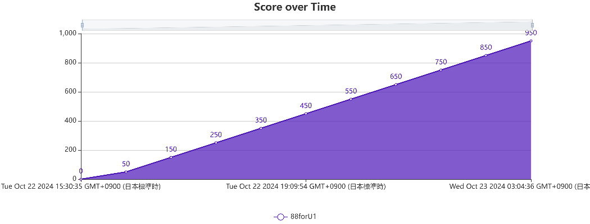
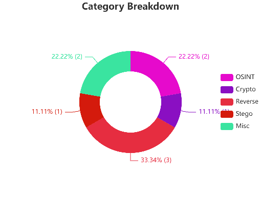
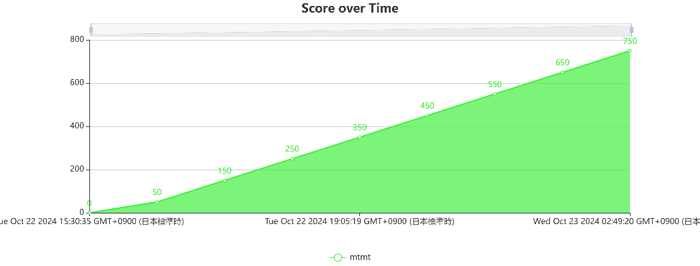

# Questcon CTF

https://questcon.ctfd.io/

950Pt (166th / 459)

## 個人結果

## 復習

- Direction
  - `\robots.txt`を確認（[Questcon WriteUp](https://qiita.com/sota70/items/8e4ee2862e309a403daa)）
  - `curl -X OPTIONS https://questcon-misdirect.chals.io/start`で使用可能なオプションを確認
  - POSTリクエストに対するレスポンスを確認

https://yocchin.hatenablog.com/entry/2024/10/24/082037
をもとにWeb問題とForensics問題の復習をする

- Something Missing?
  - pngファイルだが、pngファイルであることを表す先頭16バイトが壊れているので修正する
  - [【画像処理】ヘッダ情報の確認とバイナリエディタからの画像編集(PNG編)](https://qiita.com/spc_ehara/items/c748ec636283df805926)参照

- Tokyo's Hidden Transmission
  - Audacity
  - https://www.dcode.fr/morse-code
